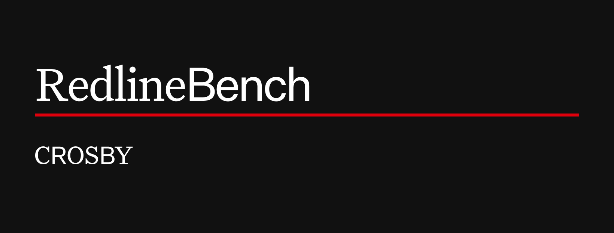

## Abstract

**Crosby–micro1 RedlineBench** measures contract negotiation as a sequence of judgment calls rather than a collection of isolated clause edits. It captures multi-turn redlining workflows through simulations grounded in realistic SaaS transactions and attorney-generated explanations of key redline decisions, and evaluates models across five dimensions: legal correctness, commercial alignment, negotiation quality, counterparty-acceptance prediction, and deal-closing orientation.

Concretely, it measures how well AI agents **redline contracts the way attorneys actually work**: by producing a real Word `.docx` with native tracked changes and threaded margin comments (the document an in-house lawyer would open in Word's Review pane) and grading it against attorney-authored rubrics with an LLM judge.

Each task drops the agent into a live contract negotiation: _you are in-house counsel for one party, at a specific turn of the negotiation; here is the contract as it stands, your playbook, and your commercial context. Produce your redline._

- **Report** ([intelligence.crosby.ai/benchmark](https://intelligence.crosby.ai/benchmark)): the published findings and methodology.
- **Code** (this repo, GitHub): the reproduction driver, scoring, judging, and metrics tooling.
- **Data** ([`crosbylegal/RedlineBench`](https://huggingface.co/datasets/crosbylegal/RedlineBench) on HuggingFace): the 140 runnable tasks. **Not committed here**; it is downloaded on demand (see [Reproducing](#reproducing)).

## What's being tested

- **Legal judgment**: finding the provisions that genuinely move your party's risk, and fixing them with legally meaningful edits
- **Negotiation craft**: responding to a counterparty's redlines: accepting, rejecting, refining, replying on comment threads; knowing when a deal is done
- **Document mechanics**: real OOXML tracked changes (`<w:ins>`/`<w:del>`) with correct attribution, surgical word-level edits, preserved numbering and cross-references
- **Communication**: every edit carries a rationale comment in a disciplined negotiation voice

## Dataset structure

**140 tasks across 3 scenarios**, each scenario a complete multi-turn negotiation between a vendor (AgentCo, an AI hiring-platform company) and an enterprise customer:

| Scenario | Deal                                                                        | Tasks |
| -------- | --------------------------------------------------------------------------- | ----- |
| 1        | Vendor-led SaaS MSA: AgentCo marks up LargeCo's template first              | 50    |
| 2        | Customer-led SaaS MSA: LargeCo writes the first markup                      | 40    |
| 3        | Professional-services MSA: AgentCo on GiantCo's procurement-heavy template  | 50    |

Tasks span **4 negotiation turns**. Turn 1 is a clean-template first markup; turns 2–4 are response turns where the document arrives carrying the negotiation so far (real tracked changes and comment threads from prior turns), and the agent must classify and respond to every existing edit.

Task names encode the negotiation tree: `redline-s{scenario}-t{turn}-g{group}{variant}`. Tasks within one input group (e.g. `g01a`, `g01b`, `g01c`) **share an identical model-facing input and differ only in which attorney's rubric set grades the output**, measuring the same performance under multiple independent expert graders. Scoring accounts for this (see [Metrics](#metrics)).

### Agent environment

Each task is a sandbox with three zones:

- **Read-only inputs**: the skill (party identity, tool mechanics, turn instructions); grounding documents (a side-specific playbook and the shared commercial context, with the counterparty's playbook never visible); and the source contract (a clean template at Turn 1, the previously-redlined draft with tracked changes visible at Turn 2+).
- **Tool surface**: the bundled `contract-redliner` skill (below).
- **Write-only output**: `/output/contract.docx`, the same document with the agent's tracked changes (`<w:ins>` / `<w:del>`) and comment entries applied.

### Task anatomy

The dataset is a single flat `tasks/` tree on HuggingFace. Each task is a self-contained, runnable [Harbor](https://harborframework.com) task:

```
tasks/redline-s1-t1-g01a/
├── task.toml            # config + metadata (scenario, turn, side, party, input_group, …)
├── instruction.md       # the attorney brief: representation, mechanics, turn context
├── environment/
│   ├── Dockerfile
│   ├── app/
│   │   ├── contract.docx        # the document to redline (edited in place)
│   │   └── grounding/           # playbook + commercial context (originals + extracted text)
│   └── skills/contract-redliner # the redlining skill (see below)
└── tests/               # verifier: LLM judge + rubrics (not visible to the agent)
    ├── rubrics.json
    ├── judge.py
    └── attorney_redlines.docx   # golden expert redline (verifier-side; 138/140 tasks)
```

The golden `attorney_redlines.docx` lives under `tests/` (the verifier side, never mounted into the agent's environment). Two turn-4 acceptance-only tasks (`redline-s2-t4-g03a`, `redline-s3-t4-g01a`) have no golden by design; the correct move there is to accept the counterparty's outstanding edits and close the deal.

### The contract-redliner skill

Agents edit the document through a bundled [skill](skills/contract-redliner/SKILL.md) of four self-contained Python scripts:

| Script             | Purpose                                                                                                                     |
| ------------------ | --------------------------------------------------------------------------------------------------------------------------- |
| `read_document.py` | Render the contract as Markdown with stable paragraph IDs + an appendix of every existing comment and tracked change        |
| `propose_edits.py` | Apply a batch of tracked changes (replace / delete / insert_after) anchored to verbatim text, each with a rationale comment |
| `add_comment.py`   | Standalone comment threads and threaded replies                                                                             |
| `mark_reserved.py` | Whole-section removal that preserves downstream numbering                                                                   |

The canonical copy lives at [`skills/contract-redliner/`](skills/contract-redliner); it is also vendored into each task's `environment/skills/` so Harbor can build the task container.

## Setup

1. Install [Harbor](https://harborframework.com) and have Docker running:

   ```bash
   uv tool install harbor
   ```

2. Install this package (Python ≥3.10):

   ```bash
   pip install -e .
   ```

3. API keys: copy `.env.template` to `.env` and fill in your own:

   | Variable                                          | Used for                                                            |
   | ------------------------------------------------- | ------------------------------------------------------------------- |
   | `OPENAI_API_KEY`                                  | OpenAI panel judge (gpt-5.4-mini) and codex agents                  |
   | `ANTHROPIC_API_KEY`                               | Anthropic panel judge (claude-haiku-4-5) and claude-code agents     |
   | `GEMINI_API_KEY` / `GOOGLE_GENERATIVE_AI_API_KEY` | Gemini panel judge (gemini-3.1-flash-lite) + Gemini/opencode agents |

## Reproducing

The benchmark data is **not** in this repo; it is resolved automatically: a local `./benchmark/` dir if present, else `$REDLINEBENCH_BENCHMARK_DIR`, else downloaded from [`crosbylegal/RedlineBench`](https://huggingface.co/datasets/crosbylegal/RedlineBench).

One command runs the whole pipeline (download tasks → Harbor agent run → assemble the 3-judge panel verdicts → score → metrics summary) and writes a `metrics_summary.json` (pass `--baseline <metrics_summary.json>` to also print a delta table against a prior run):

```bash
# Full benchmark (all 140 tasks)
redlinebench-reproduce --agent claude-code --model anthropic/claude-opus-4-8 --n-concurrent 8

# Cloud-parallel run on Modal
redlinebench-reproduce --agent claude-code --model anthropic/claude-opus-4-8 --env modal --n-concurrent 8

# One-task smoke test
redlinebench-reproduce --agent claude-code --model anthropic/claude-opus-4-8 --task redline-s1-t1-g01a
```

A full re-run is **non-deterministic** (agent sampling + LLM judges), so run-to-run deltas are expected and informational; the benchmark's core finding is task difficulty, not an exact score. Cloud-parallel runs (e.g., Modal) are available via `--env`.

Harbor supports many [agents](https://www.harborframework.com/docs/agents) (`codex`, `opencode`, or your own), any of which can drive RedlineBench.

## Metrics

**Per task** the verifier:

1. **Validity gate**: the output must be a loadable `.docx` containing at least one tracked change _or_ comment attributed to the task's author string. Gate failure → reward 0.
2. **LLM judge**: the redline is rendered to an inline-annotated view (`~~deletions~~`, `++insertions++`, `{cmt-N}` with a comment appendix) and graded PASS/FAIL against each rubric. Rubrics are weighted 1–10; a small number carry **negative weights** (penalties for edits the attorney flagged as undesirable).
3. **Score**: `reward = clamp(Σ earned − Σ penalties, 0, Σ positive weights) / Σ positive weights` ∈ [0, 1].

**Benchmark level**: per-task scores are first **averaged within each input group**, then aggregated as the mean over groups, overall and broken out per turn, per side, and per scenario. **Judging** uses a 3-judge panel (`gpt-5.4-mini` + `claude-haiku-4-5` + `gemini-3.1-flash-lite`, intentionally outside the families of benchmarked models) with strict-majority vote per rubric.

Every rubric criterion maps to one of five evaluation dimensions. Their share of all rubrics across the benchmark:

| Dimension                          | Share of rubrics | What it penalizes                                                                                            |
| ---------------------------------- | ---------------: | ----------------------------------------------------------------------------------------------------------- |
| Commercial context                 |            33.4% | Contradicts explicit business instructions (budget caps, go-live dates, deal-breakers); proposes fallbacks outside guardrails |
| Legal correctness                  |            25.7% | Misstates the law; introduces unenforceable language; creates ambiguity or conflicts elsewhere in the contract            |
| Negotiation quality                |            17.0% | Over- or under-aggressive for the leverage and stage; concedes key terms too easily; over-lawyers immaterial issues       |
| Deal-closing orientation           |            13.7% | Optimizes for "winning" every term rather than closing; prolongs the markup with minor, low-impact edits                  |
| Counterparty-acceptance prediction |            10.2% | Proposes obvious non-starters; fails to recognize already-favorable language; accepts extreme positions without justification |

The reference models run through this pipeline are GPT-5.5, Claude Opus 4.8, Gemini 3.5 Flash, and Claude Fable 5.

## Documentation

- [Guide](docs/GUIDE.md): setup, API keys, smoke tests, full reproduction, and CLI reference.
- [Benchmark Design](docs/DESIGN.md): task format, dataset layout, schemas, and the redlining skill.
- [Evaluation](docs/EVALUATION.md): validity checks, rubric judging, aggregation, diagnostics, and metrics summaries.

## Repo layout

```
src/             # flat Python modules: reproduce, metrics_summary, aggregate, panel, rejudge,
                 #   runs_reader, panel_reader, docx_metrics, judging, dataset
schemas/         # task / prediction / grade JSON schemas
skills/          # the canonical contract-redliner skill
docs/            # guide, benchmark design, and evaluation notes
benchmark/       # gitignored: the dataset, downloaded from HuggingFace at runtime
```

## License

Code: MIT (© 2026 Crosby Legal). Dataset: CC-BY-4.0. See [LICENSE](LICENSE).

## Judge-call audit trail

Every LLM judge call flows through one chokepoint (`judging.call_judge`),
shared by re-judging, the judge panel, and reproduction. Setting the
`REDBENCH_JUDGE_AUDIT_DB` environment variable to a writable SQLite path
turns on an **opt-in audit trail**: each judge call is recorded with its
model, system/user prompt, raw response, attempt count, latency, and
outcome (ok / error). Unset, the default judging path is unchanged.

This is the persistent-state / audit-trail harness scaffold — adapted from
*Harnessing LLMs for Reliable Academic Supervision: A Comparative Study*
(arXiv:2607.14707) — which argues reliability comes from deterministic
scaffolding around an LLM core. Capturing raw judge responses makes
verdict-format regressions (e.g. panel scoring zeroing out on a raw
verdict) debuggable after the fact. The audit is best-effort and never
breaks the judging path.

```bash
REDBENCH_JUDGE_AUDIT_DB=./judge_audit.sqlite3 redlinebench-rejudge ...
sqlite3 ./judge_audit.sqlite3 "SELECT ts, model, attempts, ok FROM judge_calls;"
```
